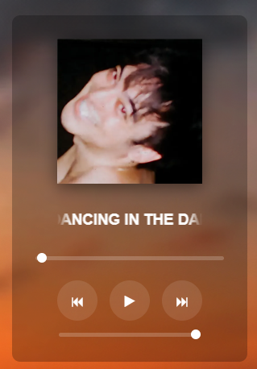

<h1>
  
  Hertz
</h1>

A simple minimalistic music player built using the Electron framework.

---

### Tech Stack

<p align="center">
  
  
  
  
</p>

Hertz is built using **HTML**, **CSS** and **Javascript** wrapped in a desktop environment **Electron**. Combining the flexibility of frontend development with the power of native application using Electron.

---

### Features

- Play, pause, next, and previous controls  
- Album-based song organization    
- Interactive progress bar (plus seeking)  
- Volume control slider  
- Glassmorphism UI with transparency  
- Auto-play next track  
- Scrolling title for long song names (title overflow handling)  

---

### Code Overview

**- index.html**
Defines the structure of the user interface, including the album art, song title, progress bar, and playback controls.
```html
<!DOCTYPE html>
<html lang="en">
  <head>
    <meta charset="UTF-8">
    <title>Hertz</title>
    <link rel="stylesheet" href="styles.css" />
  </head>

  <body>
   <div class="container">
      <audio id="audio"></audio>
      
      
      <div class="title-container">
        <h3 id="title">Song Name</h3>
      </div>

      <input type="range" id="progress" value="0" min="0" max="100">

      <div class="controls">
        <button id="prev">⏮</button>
        <button id="play">▶</button>
        <button id="next">⏭</button>
      </div>

      <input type="range" id="volume" min="0" max="1" step="0.01" value="1">
    </div>

    <script src="script.js"></script>
  </body>
</html>

```

<br>

**- styles.css**
Defines the visual appearance of the application, including layout, spacing, glassmorphism effects, animations, and responsive positioning of UI elements.
```css
body{
  margin:0;
  width:100vw;
  height:100vh;

  display:flex;
  justify-content:center;
  align-items:center;

  background:transparent;
  color:white;
  font-family:sans-serif;
}

.container{
  width:100%;
  height:100%;

  display:flex;
  flex-direction:column;
  justify-content:center;
  align-items:center;

  background:rgba(0, 0, 0, 0.25);
  backdrop-filter:blur(15px);

  border-radius:10px;

  -webkit-app-region:drag;
}

#cover{
  width:180px;
  height:180px;
  object-fit:cover;
  margin-bottom:5px;

  box-shadow:0 4px 20px rgba(0, 0, 0, 0.5);
}

.title-container{
  mask-image:linear-gradient(
    to right,
    transparent,
    black 10%,
    black 90%,
    transparent
  );

  width:180px;              
  overflow:hidden;
  white-space:nowrap;
  margin-top:10px;

  display:flex;
  justify-content:center;
}

#title{
  display:inline-block;
  text-align:center;
}

@keyframes scrollText{
  0%   { transform:translateX(0); }
  50%  { transform:translateX(calc(-100% + 180px)); }
  100% { transform:translateX(0); }
}

.scroll{
  animation:scrollText 6s linear infinite;
}

.controls{
  display:flex;
  align-items:center;
  justify-content:center;
  gap:15px;
  margin-top:10px;
}

button{
  background:rgba(255, 255, 255, 0.1);
  border:none;
  color:white;

  width:50px;
  height:50px;

  border-radius:50%;
  font-size:18px;
  cursor:pointer;

  transition:0.2s;

  -webkit-app-region:no-drag;
}

#progress{
  width:80%;
  margin:15px 0;
  cursor:pointer;

  -webkit-app-region:no-drag;
}

#volume{
  width:60%;
  margin-top:15px;
  cursor:pointer;

  -webkit-app-region:no-drag;
}

input[type="range"]{
  appearance:none;
  height:5px;
  background:rgba(255,255,255,0.2);
  border-radius:5px;
}

input[type="range"]::-webkit-slider-thumb{
  appearance:none;
  width:12px;
  height:12px;
  background:white;
  border-radius:50%;
  cursor:pointer;
}

button:hover{
  background:rgba(255,255,255,0.25);
}
```

<br>

**- main.js**
Handles the Electron main process, including creating the application window and managing IPC communication for window controls.
```js
const{app, BrowserWindow}=require("electron");

function createWindow(){
  const win=new BrowserWindow({
    width: 292,
    height: 430,
    resizable: false,
    maximizable: false,
    fullscreenable: false,
    frame: false, 
    transparent: true,
    webPreferences: {
       nodeIntegration: true,
       enableRemoteModule: true,
       contextIsolation: false
    }
  });

  win.loadFile("index.html");
}

app.whenReady().then(createWindow);

app.on("window-all-closed", ()=>{
  if (process.platform!=="darwin") app.quit();
});
```

<br>

**- script.js**
Handles the core functionality of the music player, including loading songs, controlling playback, updating the progress bar, managing volume, handling UI interactions, and dynamically updating song metadata and album art.
```js
const songs=[
  "../songs/nectar/Joji - 777.mp3",
  "../songs/ballads1/Joji - COME THRU.mp3",
  "../songs/nectar/Joji - Ew.mp3",
  "../songs/nectar/Joji - Gimme Love.mp3",
  "../songs/nectar/Joji - High Hopes.mp3",
  "../songs/ballads1/Joji - I'LL SEE YOU IN 40.mp3",
  "../songs/nectar/Joji - Like You Do.mp3",
  "../songs/nectar/Joji - MODUS.mp3",
  "../songs/nectar/Joji - Mr. Hollywood.mp3",
  "../songs/nectar/Joji - NITROUS.mp3",
  "../songs/nectar/Joji - Normal People (ft. rei brown).mp3",
  "../songs/nectar/Joji - Pretty Boy (ft. Lil Yachty).mp3",
  "../songs/nectar/Joji - Reanimator (ft. Yves Tumor).mp3",
  "../songs/nectar/Joji - Run.mp3",
  "../songs/nectar/Joji - Sanctuary.mp3",
  "../songs/ballads1/Joji - SLOW DANCING IN THE DARK.mp3",
  "../songs/ballads1/Joji - TEST DRIVE.mp3",
  "../songs/nectar/Joji - Tick Tock.mp3",
  "../songs/ballads1/Joji - WANTED U.mp3",
  "../songs/ballads1/Joji - WHY AM I STILL IN LA (ft. Shlohmo & D33J).mp3",
  "../songs/ballads1/Joji - YEAH RIGHT.mp3",
  "../songs/nectar/Joji - Your Man.mp3",
  "../songs/nectar/Joji & Diplo - Daylight.mp3",
  "../songs/nectar/Joji & BENEE - Afterthought.mp3",
  "../songs/ballads1/Joji ft. Clams Casino - CAN'T GET OVER YOU.mp3",
  "../songs/ballads1/Joji ft. Trippie Redd - R.I.P.mp3"
];
const albumCovers={
  "nectar":"../album-covers/nectar.png",
  "ballads1":"../album-covers/ballads1.png"
};

let currentIndex=0;

const audio=document.getElementById("audio");
const playButton=document.getElementById("play");
const nextButton=document.getElementById("next");
const prevButton=document.getElementById("prev");
const titleContainer=document.querySelector(".title-container");
const title=document.getElementById("title");
const cover=document.getElementById("cover");
const progress=document.getElementById("progress");
const volume=document.getElementById("volume");

function getAlbum(song){
  return song.split("/")[2]; 
}

function getCover(song){
  const album=getAlbum(song);
  
  if(albumCovers[album]) return albumCovers[album];
  return "../album-covers/defaultCover.png";
}

function getTitle(song){
  let name=song.split("/").pop();        
  name=name.replace(".mp3","");            
  
  return name;
}

function loadSong(index){
  const song=songs[index];
  
  cover.src=getCover(song);
  audio.src=song;
  title.innerText=getTitle(song);
  progress.value=0;

  handleTitleOverflow();
}

let isPlaying=false;

playButton.onclick=()=>{
  if(!isPlaying){
    audio.play();
    playButton.innerText="⏸";
  }else{
    audio.pause();
    playButton.innerText="▶";
  }
  isPlaying=!isPlaying;
};

nextButton.onclick=()=>{
  currentIndex=(currentIndex+1)%songs.length;
  loadSong(currentIndex);
  audio.play();
  playButton.innerText="⏸";
  isPlaying=true;
};

prevButton.onclick=()=>{
  currentIndex=(currentIndex-1+songs.length)%songs.length;
  loadSong(currentIndex);
  audio.play();
  playButton.innerText="⏸";
  isPlaying=true;
};

audio.addEventListener("timeupdate", ()=>{
  const percent=(audio.currentTime/audio.duration)*100;
  progress.value=percent||0;
});

progress.addEventListener("input", ()=>{
  const time=(progress.value/100)*audio.duration;
  audio.currentTime=time;
});

volume.addEventListener("input", ()=>{
  audio.volume=volume.value;
});

function handleTitleOverflow(){
  title.classList.remove("scroll");
  title.style.transform="";

  if(title.scrollWidth>titleContainer.clientWidth){
    titleContainer.style.justifyContent="flex-start";
    title.classList.add("scroll");
  }else{
    titleContainer.style.justifyContent="center";
  }
}

loadSong(currentIndex);
```

---

### Preview


---

### Project Structure

```text
hertz/
├── songs/
│   ├── album1/
│   |   ├── song1.mp3
|   |   ├── song2.mp3
|   |   └── ...
|   ├── album2/
|   |   ├── song1.mp3
|   |   ├── song2.mp3
|   |   └── ...
|   └── ...
└── src/
    ├── assets/
    |   ├── icon.ico
    |   ├── playButton.png
    |   └── ...
    ├── main.js
    ├── index.html
    ├── style.css
    ├── script.js
    ├── package.json
    └── package-lock.json
```

---

### How To Run

Follow these steps to run Hertz locally:

1. Install **Node.js** and it's package manager: nodejs.org/en/download
2. Clone the repositry either via the GitHub website or run the following command in your terminal

```bash
git clone https://github.com/17sync/Hertz.git
```
3. Install dependencies
```bash
npm install
```
4. Start the application
```bash
npm start
```


---